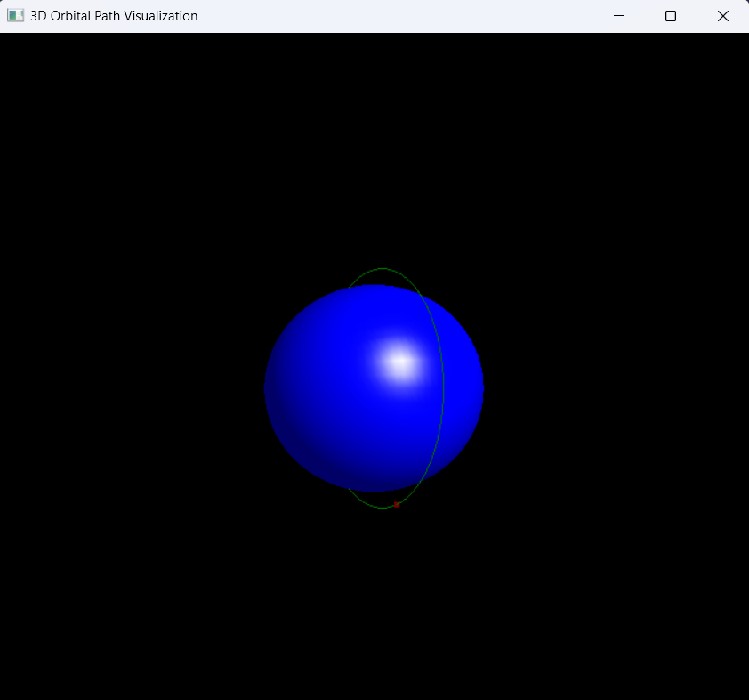

# 3D Orbital Simulator

## Overview
This project is a 3D Orbital Simulation using C++ and OpenGL. It simulates the motion of a satellite around Earth using numerical integration methods (Euler & RK4) and visualizes it in real-time 3D.

## Features
- 3D Orbital Propagation using Euler and Runge-Kutta 4 (RK4) integration.
- J2 Perturbation and Atmospheric Drag for realistic orbital effects.
- OpenGL Visualization with real-time rendering.
- Camera Controls (Rotate, Zoom, Pan).
- Realistic Lighting & Shadows for better 3D effects.
- Data Export to CSV for post-processing.

## Orbital Propagation
The simulation models a satellite’s motion around Earth by solving Newton’s Equations of Motion numerically.

### Implemented Integrators
1. Euler Method (Basic, low accuracy)
2. Runge-Kutta 4th Order (RK4) (More accurate)

### Implemented Perturbations
1. J2 Perturbation (Earth's Oblateness Effect)
2. Atmospheric Drag (For low-Earth orbits)

**Code Reference:** [`orbit_propagator.cpp`](src/orbit_propagator.cpp)

## 3D OpenGL Visualization
The visualization is implemented in OpenGL + GLUT. It renders:
- Earth as a 3D Sphere
- Satellite’s Orbit Path (using `glVertex3f()`)
- Real-time Satellite Motion
- Interactive Camera Controls



**Code Reference:** [`opengl_visualizer.cpp`](src/opengl_visualizer.cpp)

### Camera Controls (Keyboard)
| Key | Action |
|-----|--------|
| W | Tilt Camera Up |
| S | Tilt Camera Down |
| A | Rotate Left |
| D | Rotate Right |
| + | Zoom In |
| - | Zoom Out |

### Lighting and Shadows
- Enabled GL_LIGHT0 to simulate sunlight.
- Applied material properties for better shading.
- Added simple shadows using GL_POLYGON_OFFSET_FILL.

## Build & Run Instructions
### Install Dependencies
Ensure you have the following installed:
- g++ (MinGW)
- OpenGL, GLUT, GLEW, GLFW

### Compile the Project
```sh
g++ src/main.cpp src/orbit_propagator.cpp src/opengl_visualizer.cpp -I include -L lib -o bin/orbital_simulator.exe -lfreeglut -lglfw3 -lglew32 -lglu32 -lopengl32 -lgdi32
```

### Run the Simulation
```sh
bin/orbital_simulator.exe
```

## Next Steps
- Improve Earth Texturing with OpenGL Shaders.
- Add Multiple Satellites with different orbital parameters.
- Real-Time Orbital Parameter Display (Velocity, Altitude).

**Contributors:** Mohsin

**Want to contribute?** Feel free to fork and submit PRs!


